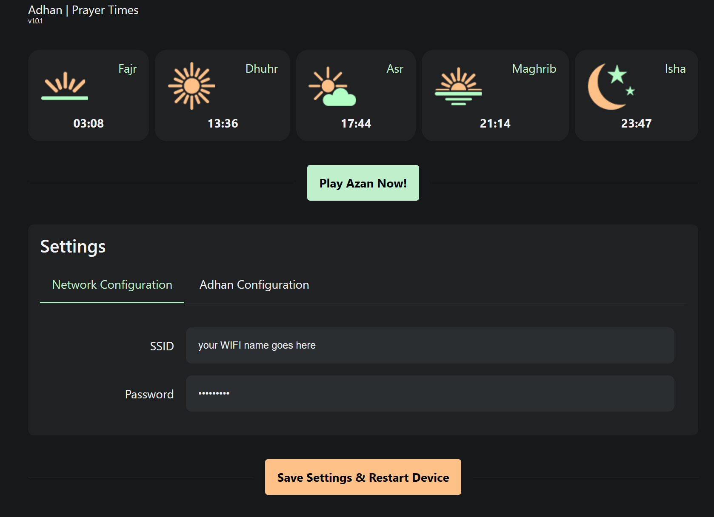
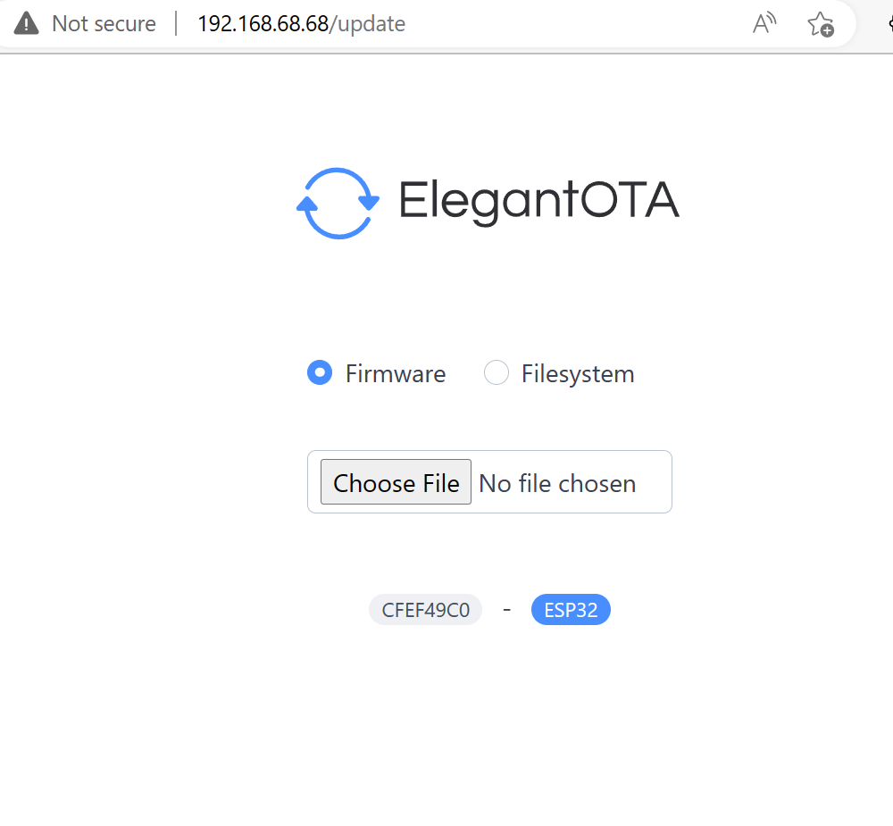

# ESP32 Prayer Times Reminder on Google Nest

This project uses an ESP32 microcontroller to retrieve and play Islamic prayer times as reminders on your Google Nest device. The prayer times are retrieved from the Aladhan API and the adhan (call to prayer) is played using MP3 files.

## Usage

To use this project, follow these steps:

1. Install the Visual Studio Code editor on your computer.

1. Install the PlatformIO extension for Visual Studio Code.

1. Open the project folder in Visual Studio Code and connect your ESP32 board to your computer.

1. Build and upload the project to your ESP32 board by running the following command in the terminal of Visual Studio Code:
    ```
    pio run -t upload -t uploadfs
    ```
1. After uploading the firmware and system files to the ESP32 board, power it on and wait a few seconds.

1. The ESP32 board will start an Access Point (AP) called `adhan_configurator`. Connect your computer or mobile device to this AP.

1. Open a web browser on your computer or mobile device and navigate to http://adhan.local.

1. On the configuration page, configure the WiFi settings for the ESP32 board and click "Save and Restart". See the screenshot below for an example of what the configuration page looks like:

    

1. The ESP32 board will now connect to your WiFi network and retrieve the prayer times from the Aladhan API. The adhan will be played using the MP3 files at the appropriate times.

Note that the screenshot shown above is for reference only and may not exactly match the version of the firmware you are using.


## OTA Updates
The firmware now includes support for over-the-air (OTA) updates, allowing users to update their devices remotely without needing physical access or a direct connection to a computer.

To perform an OTA update, you need to download the latest firmware.bin and spiffs.bin files from the latest release on this repository. You can find the latest release by navigating to the "Releases" tab on the repository page. Once you have downloaded the files, you need to upload them to the device using the OTA update page.

To access the OTA update page, navigate to the IP address associated with your device and append "/update" to the URL. For example, if the device's IP address is 192.168.1.100, the OTA update URL would be http://192.168.1.100/update.



For more information on how to initiate an OTA update, refer to the documentation or the provided screenshot.

## License

This project is licensed under the MIT License - see the [LICENSE](LICENSE) file for details.


## Credits
This firmware includes support for over-the-air (OTA) updates using the ElegantOTA library, which can be found at https://github.com/ayushsharma82/ElegantOTA. Thank you to Ayush Sharma for developing this helpful library!


